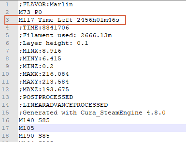
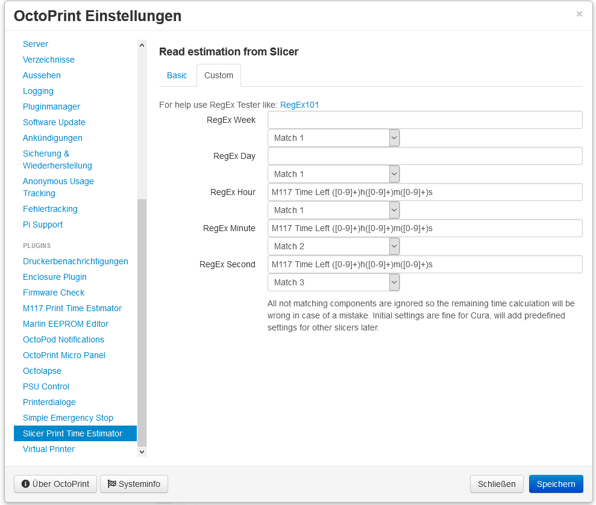

# Slicer Estimator is a generic implemenation to interpret M73 and M117 commands from slicer to set remaining time to print
With this plugin and active Post Processing in e.g. Cura you will get an exact estimation of time remaining as it will set from information analysed by the slicer. So it will be very accurate. Thanks to arhi for the idea and first implementation.

The default configuration matches the syntax of the following slicers, but you can change it in the plugin configuration according your needs.

* Cura M117
* Cura native
* Slic3r Prusa Edition
* Simplify 3D

Example: For the following command "M117 100% Remaining 1 weeks 6 days ( 07:54:19 )" you can use RegEx "M117 .+ Remaining ([0-9]+) weeks.+" with Match 1 to get the weeks. To get the minutes you should use "M117 .+ Remaining .+\( ([0-9]+):([0-9]+):([0-9]+) \)" and Match 2 to avoid an issue if weeks are not shown. 

## Slicers supported
### Cura M117
M117 is read out of M117 commands added by Cura if the following Post-Processing actions are activated. This will update continouusly the remaining printing time

### Cura native
With Cura native no changes has to be applied. The overall printing time as a comment to the GCODE which will be read by the plugin. For a correct estimation the percentage done is used as there is only the overall printing time present.

### Simply3D
With Cura native no changes has to be applied. The overall printing time as a comment to the GCODE which will be read by the plugin. For a correct estimation the percentage done is used as there is only the overall printing time present.

### Slic3er Prusa Edition
The M73 GCODE has to be activated that the correct remaining time can be read out.

## Notes
 * In case there are no matching information available the original estimator from OctoPrint will be used. If Slicer Estimator is used you can see that by the green dot right to the estimation.
 * In case SDCARD print is used the original estimator from OctoPrint will be used
 * For known slicers only the slicer has to be selected and the slicers Post Processing has to be set. If no corresponding commands are found standard estimation is used.

 

I like to suggest regex101.com for testing and to get the right match group.

