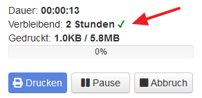
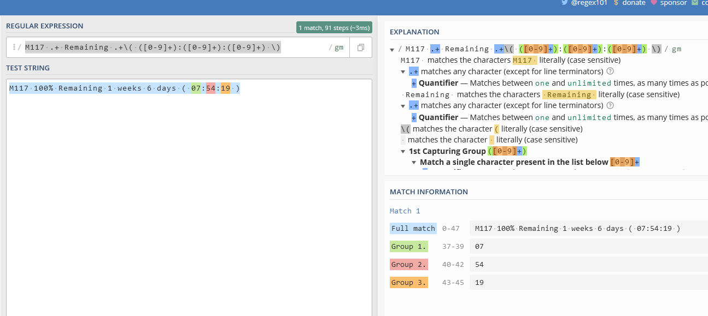

# Slicer Estimator is a generic implemenation to read remaining time to print embedded in the GCODE file by the slicer
With this plugin you can use the more accurate estimation of time remaining of the slicer instead of Octoprints estimations. So it will be very accurate, as the slicer created each command of the GCODE. Thanks to arhi for the idea and first implementation.

The default configuration matches the syntax of the following slicers, but you can change it in the plugins custom settings according your needs.

* Cura M117
* Cura native
* Simplify 3D
* Slic3r Prusa Edition

You can see that Slicer Estimator detected the embedded remaining time if the dot right of the estimation looks like this:

If you did not get a popup if you hover over the dot everything is fine. (have to check if I can add my own color in the future)

## Slicers supported

### Cura
With Cura native no changes has to be applied to Cura. The overall print time is read out of a comment in the GCODE. For a correct estimation Octoprints percentage done is used as there is only the overall print time available.
### Cura M117
Remaining time is read out of M117 commands added by Cura if the following Post-Processing actions are activated. This will update continouusly the remaining print time

### Simplify3D
With Simplify3D no changes has to be applied to Simplify3D. The overall print time is read out of a comment in the GCODE. For a correct estimation Octoprints percentage done is used as there is only the overall print time available.

### Prusa Slicer
Remaining time is read out of M73 commands added by Prusa Slicer. This will update continouusly the remaining print time

## Notes
 * In case there are no matching information available the original estimator from OctoPrint will be used. If Slicer Estimator is used you can see that by the green dot right to the estimation.
 * In case SDCARD print is used the original estimator from OctoPrint will be used
 * For known slicers only the slicer has to be selected and the slicers Post Processing has to be set. If no corresponding commands are found standard estimation is used.
 * Compared to some slicer estimations the average estimation by Octoprint (based on the average of the last real prints) could be more accurate. So you can change in the settings if you like to use average estimation if available.
 * GCODE files will be scanned in background so until the necessary information is found the Octoprint estimator is used. But so there is no delay in start printing but with files e.g. 150Mbyte in size the scan could take some seconds.

## Custom Settings
Example: For the following command "M117 100% Remaining 1 weeks 6 days ( 07:54:19 )" you can use RegEx "M117 .+ Remaining ([0-9]+) weeks.+" with Match 1 to get the weeks. To get the minutes you should use "M117 .+ Remaining .+\( ([0-9]+):([0-9]+):([0-9]+) \)" and Match 2 to avoid an issue if weeks are not shown. 

 

I like to suggest regex101.com for testing and to get the right match group.

